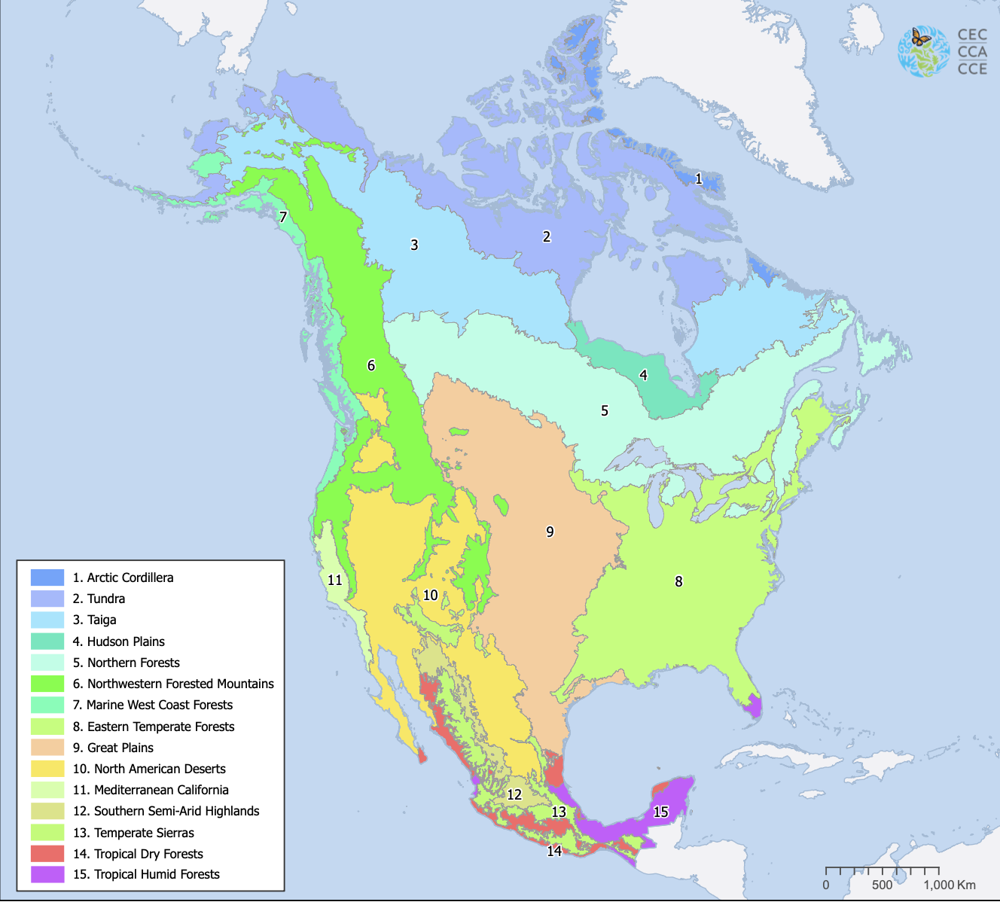
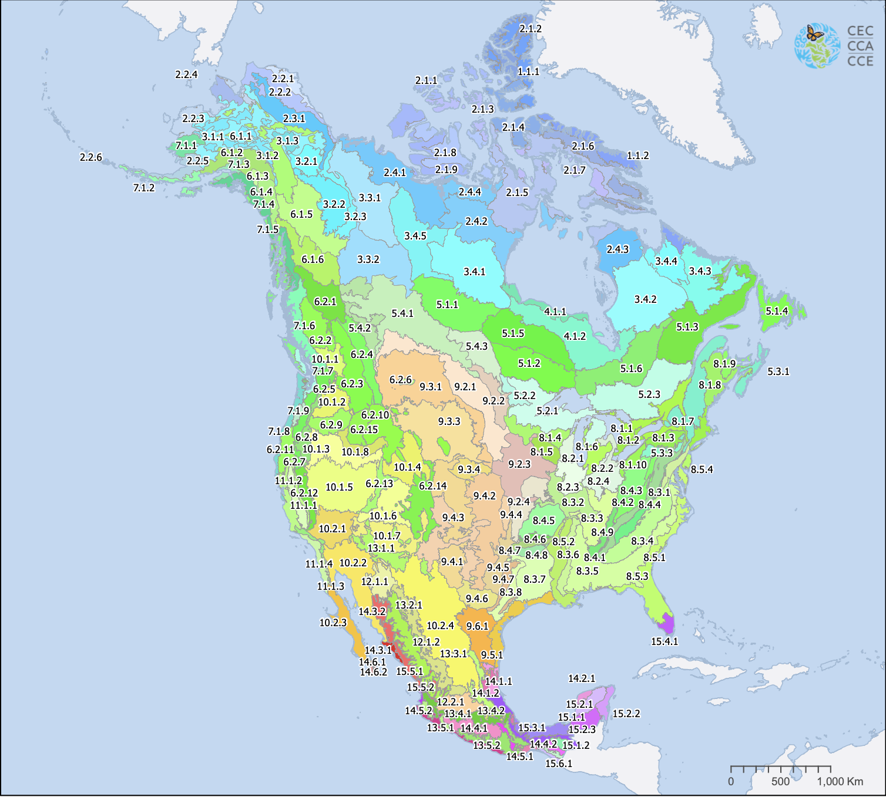

# Data Guide

SOMOSPIE is built upon publicly available datasets that describe:

- Remotely-sensed coarse soil moisture
- Terrain Parameters (covariates)
- Eco-regionalization of North America

## 💧 Soil Moisture Data

The first data point needed for SOMOSPIE is coarse soil moisture datasets (SM). Publicly available soil moisture data is available from the European Space Agency Climate Change Initiative (ESA-CCI) project from 1979 to 2020, hosted at: [https://www.esa-soilmoisture-cci.org](https://www.esa-soilmoisture-cci.org/). 

### Custom Soil Moisture Data
SOMOSPIE also allows the use of local files. The data must match the following specifications. While multiple formats are supported, GeoTIFF and CSV files are recommended for optimal compatibility. 

**Provided Formats**

- NetCDF (.nc) files for soil moisture for each day of a provided year. Must be stacked into soil moisture data for each month of the year. 

**Other Acceptable Formats**

- rds, tif, & sdat files stackable in R with stack()
- Comma-separated .csv or .txt files

Datasets must include two columns specifying longitude and latitude coordinates, and at least one column containing soil moisture values.

**Example of a Dataset** 

| Index | Latitude | Longitude| Soil Moisture|
| ----- | -------- | ------ | ------ |
| 0     | -101.375 | 37.125 | 0.1121 |
| 1     | -101.125 | 37.125 | 0.1603 |
| ...   | ...      | ...    | ...    |
| 479   | -103.000 | 33.625 | 0.3485 |

!!! note "Soil Moisture Data Fetching and Preprocessing"

    - Section "Preparing Soil Moisture Data" of [Data Preparation](./data_preparations.md) elaborates on soil moisture preprocessing methods.
    - Section "Fetching Soil Moisture Data" of [Additional Features](./additional_features.md) explains how to install the provided soil moisture data from ESA-CCI. 

## ⛰️ Terrain Parameters

Terrain parameters, also known as covariates, are values that describe the physical features and landscape of the Earth. [GEOtiled](https://globalcomputing.group/GEOtiled/library/) is a library built for SOMOSPIE that, when provided with Digital Elevation Models (DEMs) representing the Earth's elevation, determines various terrain parameters, such as slope, aspect, and hillshade. These parameters are directly utilized by SOMOSPIE, serving as inputs to the machine learning algorithms and therefore as predictors of soil moisture. The final soil moisture estimates will be the same size as the provided terrain parameters, which may range in spatial resolution from kilometers to meters.

The terrain parameters should be in raster format, such as .tif, where they will eventually be merged with soil moisture data for model fitting/training. 

!!! note "SM Data Fetching and Preprocessing"

    - Section "Preparing Terrain Parameters Data" of [Data preparation](data_preparations.md) elaborates on preprocessing steps for terrain parameters. 
    - Section "Fetching Terrain Parameters" of [Additional Features](additional_features.md) elaborates on how to fetch and download pre-computed terrain parameters.

## 🌐 Ecoregion Boundaries

We utilize the 2011 Commission for Environmental Cooperation (CEC) ecoregion dataset to define the spatial limits of soil moisture estimates. This dataset divides North America into polygon-based ecoregions at three levels. Levels I through III are used to describe similarity within each region. Level I ecoregions are larger and encapsulate the smaller Level II regions. Using the higher-level regions results in speedups from a smaller region of interest. 

{ width="49%" }
{ width="49%" }
*Level I ecoregions (left) and Level III ecoregions (right) - [Source](https://www.cec.org/north-american-environmental-atlas/terrestrial-ecoregions-level-i/){:target="_blank"}*

For large-scale runs of SOMOSPIE, we recommend defining a region of interest. The [Data Preparation Guide](./data_preparations.md) provides instructions on how soil moisture data and terrain parameters can be cropped to an ecoregion. 