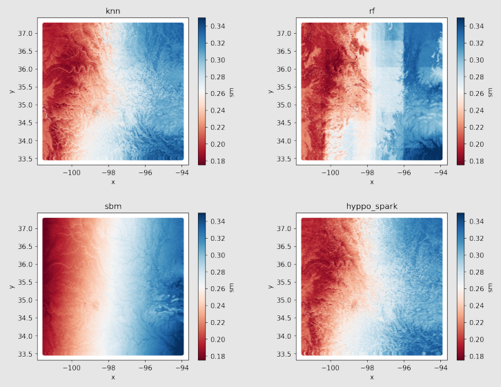

# Soil Moisture Predictions

SOMOSPIE leverages five machine learning algorithms for soil moisture predictions. The data must be prepared into a .csv file according to the [Data Preparation and Preprocessing Guide](./data_preparations.md).

Following the [Data Guide](./data_guide.md) can provide guidance on how to prepare data for the machine learning algorithm. Preprocessing should result in a single .csv file for training. Each model will estimate the soil moisture at a finer resolution.

This guide provides a brief overview of various machine learning implementations and how to run them for soil moisture predictions. Each model accepts a variety of arguments tailored to its specific needs. Any machine learning algorithm mentioned can be run through the command line or within a Jupyter Notebook.

## K-Nearest Neighbors

Predicts the soil moisture at each training point based on the K-Nearest neighbors regression. It is a simple algorithm that performs better when considering more neighbors, at the cost of efficiency. It tends to be the least accurate and noisy model, and serves as a baseline.

The K-Nearest Neighbors model can be run through the command line using:

```bash
python3 hyppo.py -t IN_TRAIN -e IN_EVAL -l LOG_FILE -m KNN -o OUT_PATH -k K
```

**Parameters**

| Name     | Type   | Description                                                     | Default   |
| -------- | ------ | --------------------------------------------------------------- | --------- |
| IN_TRAIN | string | Path to the .csv input file containing training data.           | —         |
| IN_EVAL  | string | Path to the .csv input file containing labeled evaluation data. | —         |
| MODEL    | string | Model to be used; KNN                                           | —         |
| LOG_FILE | string | Path to the outputted log file, defaults to the console.        | `console` |
| OUT_PATH | string | Path of the model's resulting predictions.                      | `None`    |
| K        | int    | Number of neighbors to consider for predictions                 | `10`      |

## Kernel Weighted K-Nearest Neighbors

A variant of K-Nearest neighbors that uses a kernel function to weigh neighbors based on proximity. Nearby neighbors have a greater influence on predicting the soil moisture at point X compared to far neighbors. The model also finds the optimal number of neighbors to consider, rather than requiring a prespecified quantity. This results in a more accurate and less noisy version of the K-Nearest Neighbors algorithm.

The Kernel Weighted K-Nearest Neighbors model can be run through the command line using:

```bash
knn.py -t IN_TRAIN -e IN_EVAL -l LOG_FILE -o OUT_PATH -k K_CAP
```

**Parameters**

| Name     | Type   | Description                                                     | Default   |
| -------- | ------ | --------------------------------------------------------------- | --------- |
| IN_TRAIN | string | Path to the .csv input file containing training data.           | —         |
| IN_EVAL  | string | Path to the .csv input file containing labeled evaluation data. | —         |
| LOG_FILE | string | Path to the outputted log file, defaults to the console.        | `console` |
| OUT_PATH | string | Path of the model's resulting predictions.                      | `None`    |
| K_CAP    | int    | Maximum number of neighbors to consider                         | `20`      |

## Random Forest

Uses an ensemble learning method, building a collection of decision trees, and predicting the resulting soil moisture values through a technique called bagging; bagging builds multiple trees based on subsets of the training dataset. When making a prediction, each decision tree is consulted, and the soil moisture prediction is the average of the predictions from each tree. It is built upon the [Scikit-Learn RandomForestRegressor](https://scikit-learn.org/stable/modules/generated/sklearn.ensemble.RandomForestRegressor.html). The random forest model tends to be less noisy than K-Nearest Neighbors, but requires a higher starting resolution for data to generate enough decision trees for accurate predictions.

The Random Forests model can be run through the command line using:

```bash
rf.py -t IN_TRAIN -e IN_EVAL -l LOG_FILE -o OUT_PATH -max_tree MAX_TREES
```

**Parameters**

| Name      | Type   | Description                                                     | Default   |
| --------- | ------ | --------------------------------------------------------------- | --------- |
| IN_TRAIN  | string | Path to the .csv input file containing training data.           | —         |
| IN_EVAL   | string | Path to the .csv input file containing labeled evaluation data. | —         |
| LOG_FILE  | string | Path to the outputted log file, defaults to the console.        | `console` |
| OUT_PATH  | string | Path of the model's resulting predictions.                      | `None`    |
| MAX_TREES | int    | Maximum number of decision trees to explore.                    | `2000`    |

## Hybrid Piecewise Polynomial Approach (HYPPO)

Builds upon the traditional K-Nearest Neighbors model by allowing non-linear predictions. Instead of averaging the values of the K-Nearest Neighbors, it creates a polynomial function that fits the neighbors. The degree of the polynomial function is selected using cross-validation to optimize the model's accuracy. Using a polynomial regression allows HYYPO to capture complex relationships in the data, leading to higher accuracy, and frequently receiving a higher R<sup>2</sup> than previous models. This accuracy comes with a significantly higher computational cost due to the fitting of a polynomial model.

HYPPO can be run through the command line using:

```bash
python3 hyppo.py -t IN_TRAIN -e IN_EVAL -l LOG_FILE -m HYPPO -o OUT_PATH -k K -D d
```

**Parameters**

| Name     | Type   | Description                                                     | Default   |
| -------- | ------ | --------------------------------------------------------------- | --------- |
| IN_TRAIN | string | Path to the .csv input file containing training data.           | —         |
| IN_EVAL  | string | Path to the .csv input file containing labeled evaluation data. | —         |
| MODEL    | string | Model to be used; HYPPO                                         | —         |
| LOG_FILE | string | Path to the outputted log file, defaults to the console.        | `console` |
| OUT_PATH | string | Path of the model's resulting predictions.                      | `None`    |
| K        | int    | Number of neighbors to consider for predictions                 | `10`      |
| d        | int    | Maximum polynomial degree of the model.                         | `3`       |

## Surrogate-Based Modeling (SBM)

SBM utilizes a regression surrogate model to derive a polynomial function for predicting soil moisture. Instead of considering a set of neighbors, SBM is a global model that attempts to approximate the behavior of all available neighbors. It utilizes a surrogate model, which only performs computations on a small subset of the original dataset to achieve increased computational performance. Like HYPPO, it leverages cross-validation to determine optimal polynomial degrees, resulting in high accuracy.

SBM can be run through the command line using:

```bash
python3 hyppo.py -t IN_TRAIN -e IN_EVAL -l LOG_FILE -m SBM -o OUT_PATH -k k -D d
```

**Parameters**

| Name     | Type   | Description                                                     | Default   |
| -------- | ------ | --------------------------------------------------------------- | --------- |
| IN_TRAIN | string | Path to the .csv input file containing training data.           | —         |
| IN_EVAL  | string | Path to the .csv input file containing labeled evaluation data. | —         |
| MODEL    | string | Model to be used; SBM                                           | —         |
| LOG_FILE | string | Path to the outputted log file, defaults to the console.        | `console` |
| OUT_PATH | string | Path of the model's resulting predictions.                      | `None`    |
| k        | int    | The number of folds in cross validation                         | `10`      |
| d        | int    | Maximum polynomial degree of the model.                         | `3`       |

## Running in Jupyter Notebooks

For interactive use, SOMOSPIE models can be executed within a Jupyter Notebook. This approach is consistent with the command line version, utilizing the same input data. However, instead of passing arguments through the command line, various Python methods are used to run the models. This allows for a flexible and interactive workflow.

```python3
model="knn"
from knn import *

# Load and prepare training/testing/evaluation data 
x_train, y_train = ...

# train kernel weighted k nearest neighbors model
knn = train_knn(x_train, y_train, maxK)

# validate the model
validate_knn(knn, x_test, y_test)

# Generate evaluation predictions
predict_knn(x_predict, evaluation_data, output_data, knn)
```
_Example implementation in a Python notebook_

## Results Visualization



_Results show varying levels of accuracy, noisiness, and smoothness_
